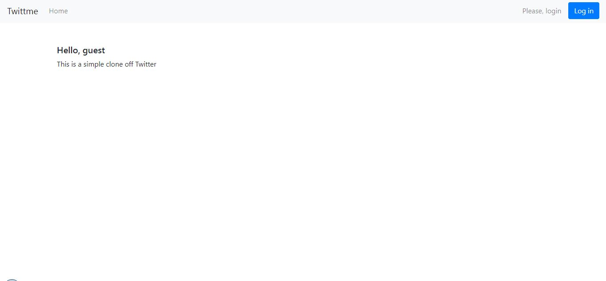
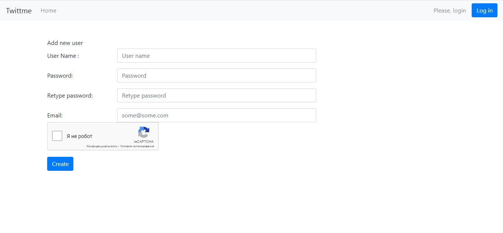
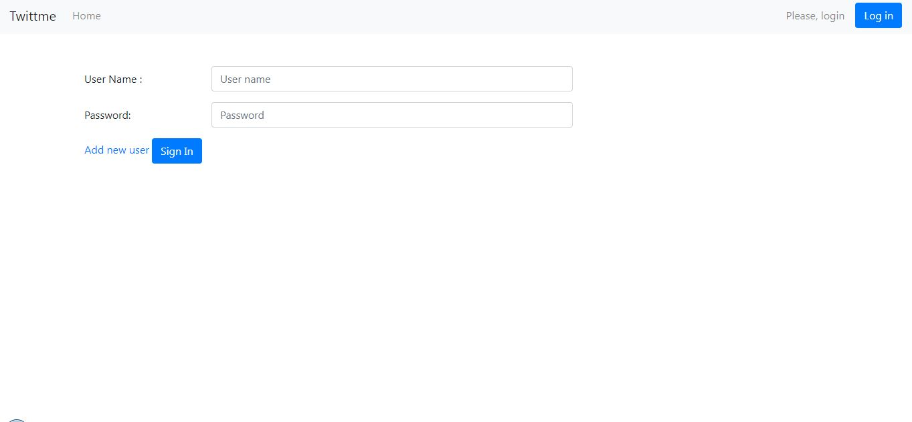
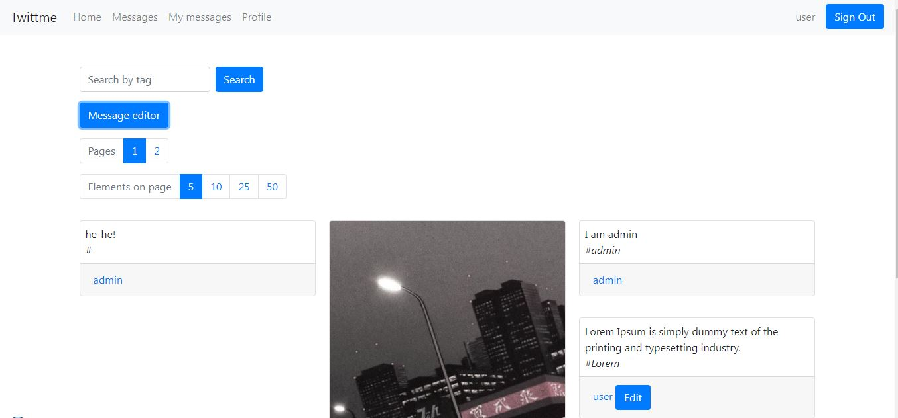
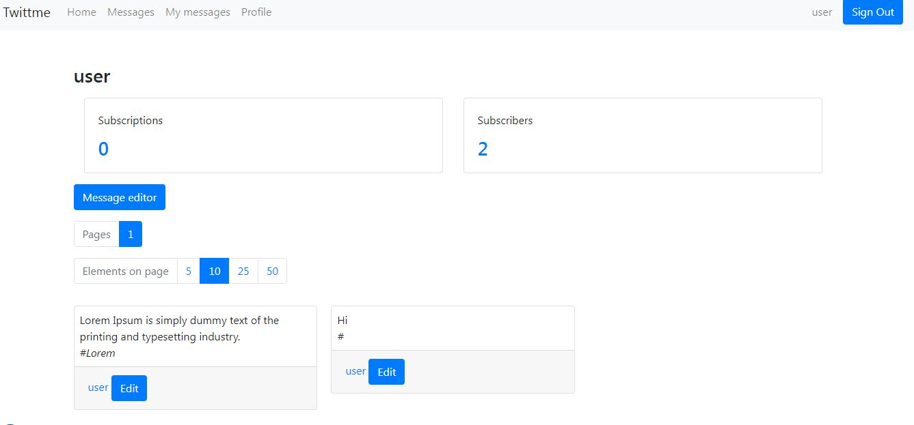
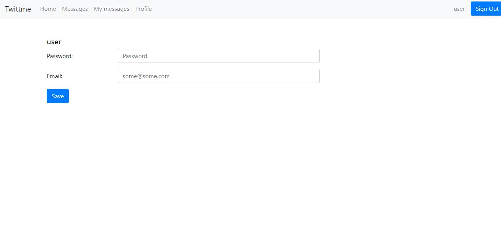
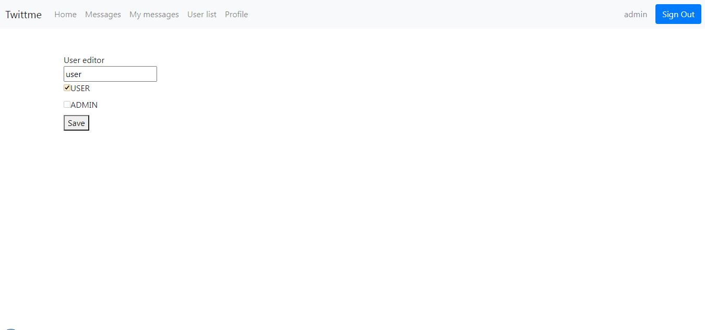

# Twittme
This is a simple clone of Twitter.

Used technologies:
- Spring boot, web, security
- Freemarker
- MySQL
- Hibernate

## Functions
- Guest
    + See home page
    + register
    + login
- User
    + logout
    + add message
    + edit own messages
    + subscribe/unsubsribe to user
    + change email, password
- Admin
    + same as user
    + edit username, role of users

## Demo
Home page

Registration page

Login page

Messages

User messages

User settings

Admin page

Maksim Yukhnevich, 2022